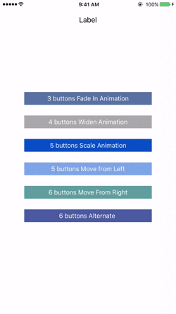
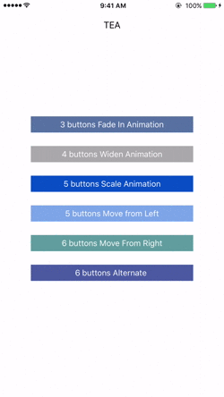
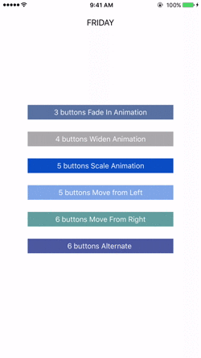

# EEJSelectMenu

<!--[](https://travis-ci.org/Ehsan Jahromi/EEJSelectMenu)-->
<!--[](http://cocoapods.org/pods/EEJSelectMenu)-->
<!--[](http://cocoapods.org/pods/EEJSelectMenu)-->
<!--[](http://cocoapods.org/pods/EEJSelectMenu)-->


EEJSelectMenu is a responsive single selection menu for iOS.  
Project allows for implementing a menu with different number of buttons and different animations for appearance.  
It will adjust the button sizes based on the device screen size!   
Just provide the names for the buttons and the menu will take care of the number and layout of the buttons!

### Demo
###### Animation: FadeIn & Widen 


###### Animation: Scale & MoveInFromLeft 


###### Animation: MoveInFromRight & Alternate 


##### Version 0.1.0


## Installation

### Using CocoaPods
EEJSelectMenu is available through [CocoaPods](http://cocoapods.org). To install
it, simply add the following line to your Podfile:

```ruby
pod "EEJSelectMenu"
```


### Using Source Files
Add the files in the source folder to your project

Import the header file to your source code
```objective-c
#import "EEJSelectMenu.h"
```


Getting Started
==================
Create an instance of EEJSelectMenu and provide button names
```objective-c
    NSArray *buttonNames = @[@"ONE",@"TWO",@"THREE",@"FOUR"];
    EEJSelectMenu *menu = [[EEJSelectMenu alloc]initWithButtons:buttonNames 
                    animationStyle:EJAnimationStyleFadeIn andDelegate:self];
    [self presentViewController:menu animated:NO completion:nil];
```    
OR
```objective-c    
    EEJSelectMenu *menu = [[EEJSelectMenu alloc]init];
    menu.buttonNames = @[@"ONE",@"TWO",@"THREE",@"FOUR"];
    menu.animationStyle = EJAnimationStyleAlternate;
    menu.delegate = self;
    
    [self presentViewController:menu animated:NO completion:nil];
```
###### Note: for smoother animation set the animated property to "NO" when presenting the menu as shown above.

#### AnimationStyle
```objective-c
    menu.animationStyle = EJAnimationStyleFadeIn; // default
```

* `Other AnimationStyles Available:`
  - `EJAnimationStyleWiden`
  - `EJAnimationStyleScale`
  - `EJAnimationStyleMoveInFromLeft`
  - `EJAnimationStyleMoveInFromRight`
  - `EJAnimationStyleAlternate`


#### Delegate Methods
EEJSelectMenu provides two delegate methods
```objective-c
    -(void)EJSelectMenuButtonWasPressedWithTitle:(NSString *)title;
    -(void)EJSelectMenuButtonWasPressedWithTag:(long)tag;
    
    // button tags start at 100 and increment by one for each
```

##### Other configurations:

Change selected button color (default: Purple)
```objective-c
    menu.selectedButtonColor = [UIColor blueColor];
```
Change menu background color (default: White)
```objective-c
    menu.menuBackgroundColor = [UIColor redColor];
```

#### License:
EEJSelectMenu is released under the MIT license. See LICENSE for details.

