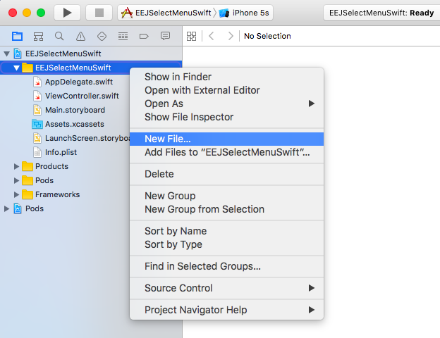
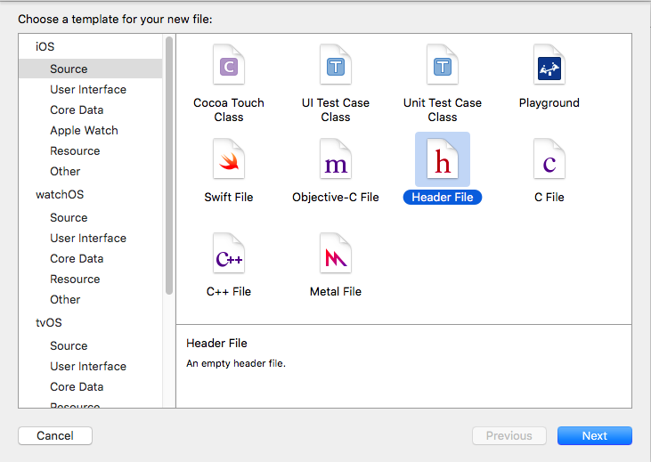
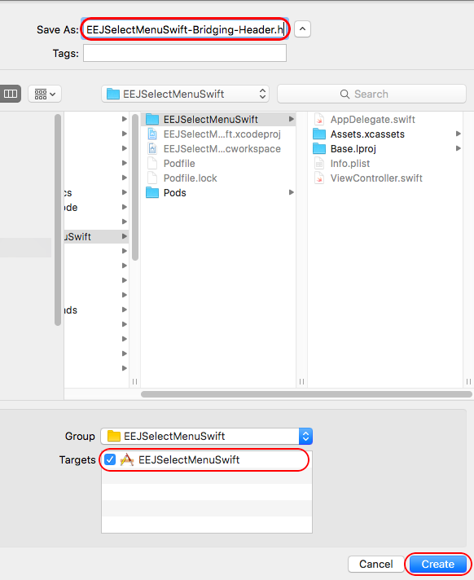
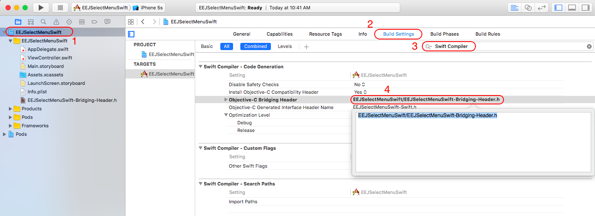
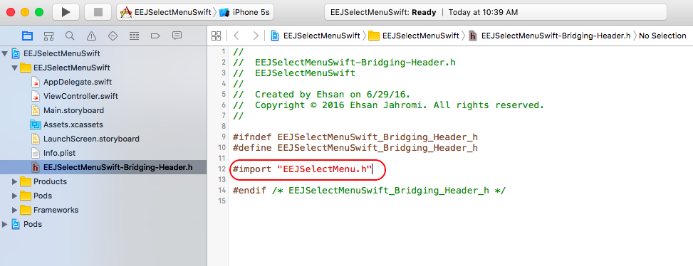
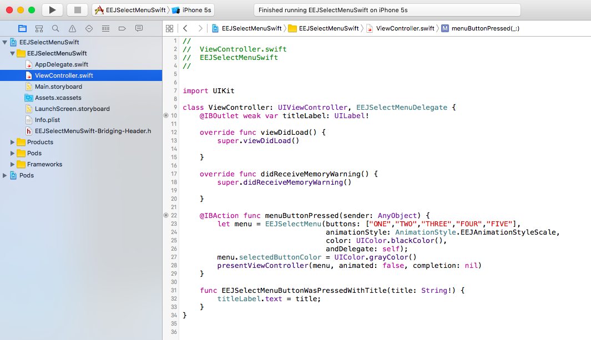

EEJSelectMenu can be implemented in a Swift project in just a few steps using a bridging header file. This page will walk you through an example of how to do exactly that!

We will be using an example project called `EEJSelectMenuSwift`

* After installing the CocoaPod, you will have to create a Bridging-Header file in order to mix Objective-C files with your Swift code.

* In XCode, Right-Click on the folder with your projects name in the File Inspector and select `New File -> Header File` from the templates menu.

* In the `Save As` field enter your projects name followed by `-Bridging-Header.h`. (So for this example, the project name `EEJSelectMenuSwift` will need to be saved as `EEJSelectMenuSwift-Bridging-Header.h`)

* Next, go to your `project settings -> Build Settings` then search for `Swift Compiler` and in the Objective-C Bridging Header field type in the path for the bridging header file that you just created. (The path should start from the root of your project - the folder containing your XCode project or workspace)

* Now Build your project (Command + B) to let the compiler know that you are using a bridging header

* Go to your bridging header file and import `EEJSelectMenu.h` file

* Now you can use EEJSelectMenu in your Swift project without importing any other headers in your files 👍  🎉

* You can find the completed EEJSelectMenuSwift example project in the [SwiftExample](https://github.com/eejahromi/EEJSelectMenu/tree/master/SwiftExample) folder.

